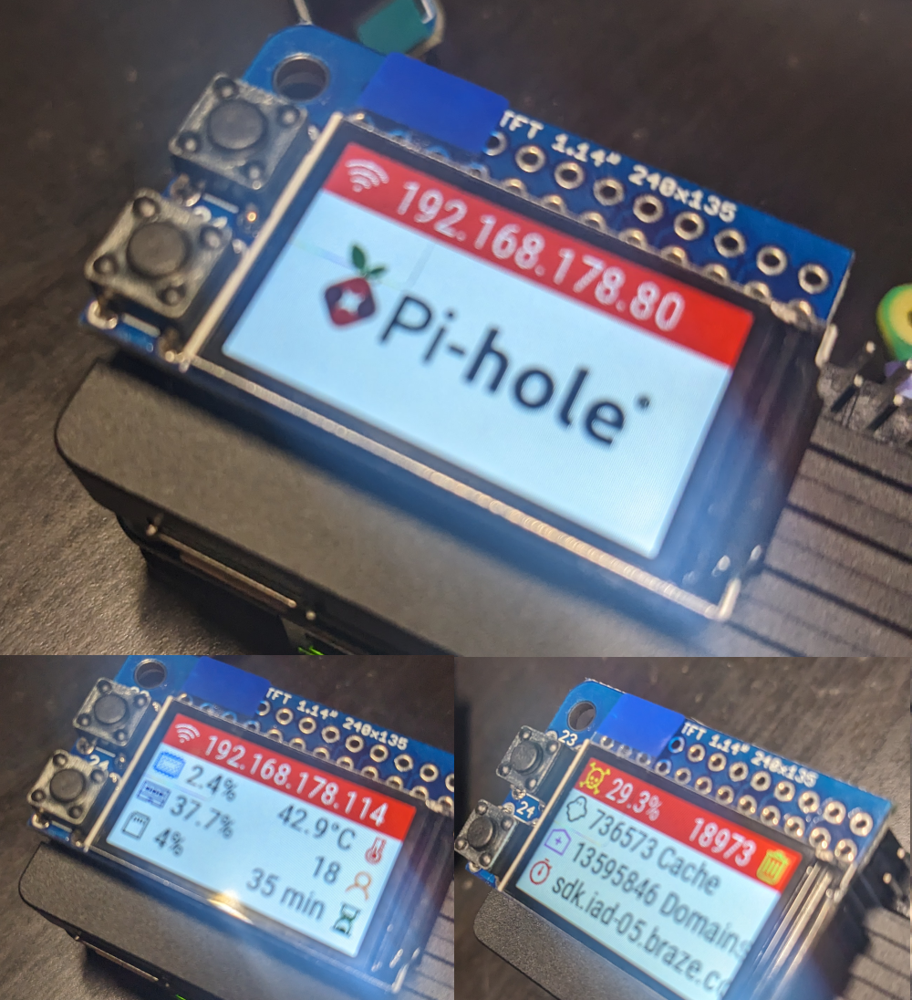
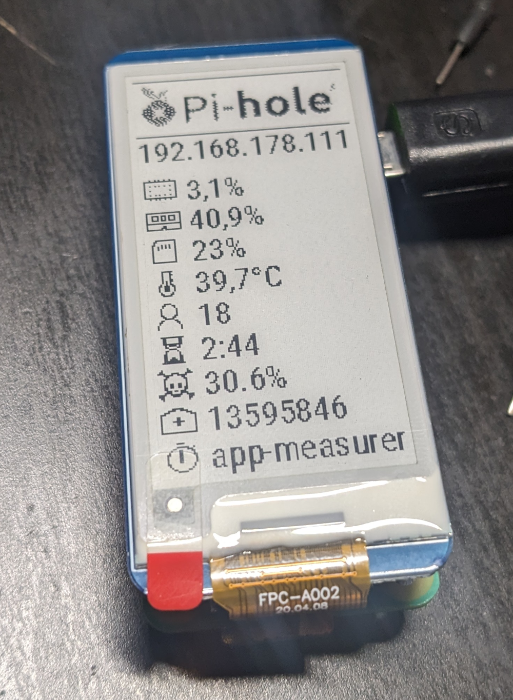

# PI-HOLE PORN

## Components

* Raspberry Pi Zero 2W
* Aluminum Alloy Heatsink for Raspberry Pi Zero 2W
* 0.91 inch OLED 128x32 I2C IIC SSD1306 blue OLED display module\
  OR 1.14inch DIYmall Mini PiTFT SPI 135x240 LCD TFT display module\
  OR 2.13inch E-Ink Display HAT 250x122 SPI display module
* Raspberry Pi Zero USB HUB HAT (B)
* ETH patch cable
* Power Adapter microUSB Charger for Raspberry Pi Zero 2W
* min. 32GB SD-card

## Raspberry Pi Imager

* Device: Raspberry Pi Zero 2 W
* OS: Raspberry Pi OS (other) -> Raspberry Pi OS Lite (64-bit)
* Storage: >32gb SD-Card
* Hostname: pi2hole
* User: alex
* Remote access: Enable SSH - Use public key authentication

Write

## Installation

router -> pi2hole (ETH) -> 192.168.178.86

* `ssh 192.168.178.86`

* `sudo apt update`
* `sudo apt upgrade -y`
* `sudo reboot`

* `ssh 192.168.178.86`

### Pi-Hole

* `curl -sSL https://install.pi-hole.net | bash`

* `sudo pihole setpassword`

### SSH Banner
* `mkdir git`
* `cd git`
* `git clone https://github.com/projekt21/pi-hole-porn.git`

* `sudo mv pi-hole-porn/10-uname /etc/update-motd.d/`
* `sudo chmod +x /etc/update-motd.d/10-uname`
* `sudo rm /etc/motd`
* `sudo sed -i 's/\#PrintLastLog yes/PrintLastLog no/g' /etc/ssh/sshd_config`
* `sudo systemctl restart sshd`
* `cd ..`

### raspi-config
* `sudo raspi-config`
  
`Interface Options -> SPI -> yes`\
`Interface Options -> I2C -> yes`

### luma-Status
* `python3 -m venv ~/luma-env`

* `~/luma-env/bin/python -m pip install --upgrade luma.oled luma.lcd gpiozero lgpio rpi-lgpio spidev requests`
* `sudo apt-get install python3 python3-pip python3-pil libjpeg-dev zlib1g-dev libfreetype-dev liblcms2-dev libopenjp2-7 libtiff-dev swig liblgpio-dev -y`

* `sudo usermod -a -G spi,gpio,i2c alex`

### Display
#### Color

* `sudo cp ~/git/pi-hole-porn/luma-color.service /etc/systemd/system/luma.service`

#### or E-Ink
* `sudo cp ~/git/pi-hole-porn/luma-eink.service /etc/systemd/system/luma.service`
* `cd ~/git`
* `git clone https://github.com/waveshareteam/e-Paper.git`
* `cd e-Paper/RaspberryPi_JetsonNano/python/`
* `cp -r lib/waveshare_epd /home/alex/git/pi-hole-porn/`

#### or B/W
* `sudo cp ~/git/pi-hole-porn/luma.service /etc/systemd/system/luma.service`
 
### luma Service
* `sudo systemctl enable luma.service`
* `sudo systemctl start luma.service`

### http://192.168.178.86/admin/
`Settings -> Teleporter -> Import previously exported configuration`

`[ ] Configuration`\
`[ ] DHCP leases`\
`[X] Groups`\
`[X] Lists`\
`[X] Domains/Regexes`\
`[ ] Clients`

Import

## List Block

### Tracking/Ads
*   https://raw.githubusercontent.com/StevenBlack/hosts/master/hosts
*   https://raw.githubusercontent.com/StevenBlack/hosts/master/extensions/fakenews/hosts
* 	https://v.firebog.net/hosts/Easyprivacy.txt
* 	https://v.firebog.net/hosts/Easylist.txt
* 	https://v.firebog.net/hosts/static/w3kbl.txt
* 	https://v.firebog.net/hosts/AdguardDNS.txt
* 	https://v.firebog.net/hosts/Admiral.txt
* 	https://adaway.org/hosts.txt
* 	https://gitlab.com/hagezi/mirror/-/raw/main/dns-blocklists/adblock/pro.txt
*  	https://raw.githubusercontent.com/FadeMind/hosts.extras/master/add.Spam/hosts
* 	https://raw.githubusercontent.com/PolishFiltersTeam/KADhosts/master/KADhosts.txt
*  	https://raw.githubusercontent.com/PolishFiltersTeam/KADhosts/master/KADhosts.txt
*  	https://raw.githubusercontent.com/anudeepND/blacklist/master/adservers.txt
* 	https://raw.githubusercontent.com/DandelionSprout/adfilt/master/Alternate%20versions%20Anti-Malware%20List/AntiMalwareHosts.txt
* 	https://phishing.army/download/phishing_army_blocklist_extended.txt
* 	https://adguardteam.github.io/HostlistsRegistry/assets/filter_9.txt

### Porn
*  https://raw.githubusercontent.com/chadmayfield/pihole-blocklists/master/lists/pi_blocklist_porn_all.list
* https://raw.githubusercontent.com/columndeeply/hosts/main/hosts00 (optional)
* https://raw.githubusercontent.com/columndeeply/hosts/main/hosts01 (optional)
* https://raw.githubusercontent.com/columndeeply/hosts/main/hosts02 (optional)
* https://raw.githubusercontent.com/columndeeply/hosts/main/hosts03 (optional)
* https://raw.githubusercontent.com/columndeeply/hosts/main/hosts04 (optional)
* https://raw.githubusercontent.com/columndeeply/hosts/main/hosts05 (optional)
* https://dbl.ipfire.org/lists/porn/domains.txt
* 	https://alex.zeitform.de/pihole/pihole-porno.txt

### Social (optional)
* https://raw.githubusercontent.com/StevenBlack/hosts/refs/heads/master/extensions/social/sinfonietta/hosts
